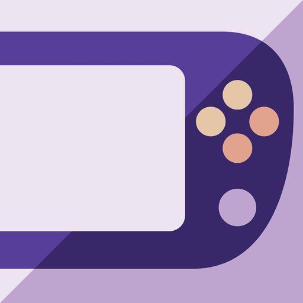

<p align="center">
  
</p>

<h1 align="center">RomM Vita</h1>

<p align="center">
  <strong>A RomM client for the PlayStation Vita.</strong><br>
  Browse your self-hosted ROM library, download games, launch them in RetroArch and sync saves and save states, all from your Vita.
</p>

<p align="center">
  <a href="../../releases/latest"></a>
  
  
  
  <a href="LICENSE"></a>
  
</p>

RomM Vita is a homebrew app for the PS Vita (HENkaku / Enso) that turns your Vita into a client for
[RomM](https://github.com/rommapp/romm), the self-hosted ROM manager. Pair it with your server once, then browse your
library, download games straight to the Vita, play them in [RetroArch](https://www.retroarch.com/) and keep your save
files and save states in sync with RomM across devices.

## Supported

| | Status |
|---|---|
| **Systems** | **SNES** via the Snes9x cores and **Game Boy Advance** (experimental) via gpSP, both in RetroArch. More systems are planned. |
| **Console** | PlayStation Vita and PlayStation TV with custom firmware (HENkaku / Enso) |
| **Emulator** | RetroArch for Vita 1.22.2 (installed separately) |
| **Server** | RomM 5.0.0 or newer |
| **Pairing** | Client API Token: type the pairing code or scan the QR code with the Vita camera |
| **Saves** | Battery saves (`.srm`) and save states, synced both ways |

## Features
- **Easy pairing:** enter the 8-character code (`XXXX-XXXX`) or scan the QR with the Vita camera. The server address
  accepts http and https, detected automatically.
- **Platform manager:** pick which system to open after connecting.
- **Offline mode:** no connection? Open your downloaded games anyway, with a list of saves and states waiting to sync.
- **Fast library:** each platform has instant search and an "installed only" view. The list is cached on the Vita and
  refreshed in the background, so it opens immediately.
- **One-button play:** downloads the ROM, then launches it in RetroArch with a compatible core.
- **Save and state sync:** pulls the newest save before you play and pushes your progress afterwards. Local files are
  backed up before anything is overwritten.
- **Core-aware save states:** a state only loads in the core that made it, so the app checks compatibility and warns
  you instead of pulling a state that cannot work on the Vita.

## Support the Project

RomM Vita is a solo passion project, built and maintained in my spare time. If it makes your RomM setup better, a small
contribution helps keep it going. There is no pressure at all: the app is and will always be free.

[](https://github.com/sponsors/abduznik)

## Requirements
- A hacked PS Vita (HENkaku / Enso) with [VitaShell](https://github.com/TheOfficialFloW/VitaShell) installed
- **RetroArch for Vita**, installed separately (see below)
- A RomM server (v5.0.0 or newer tested) reachable from the Vita over Wi-Fi - use the server's **LAN address**,
  the Vita can't use Tailscale/VPN addresses
- A RomM **Client API Token** (see below)

## Setup

### 1. Install RetroArch
RomM Vita does not bundle an emulator; it launches the official RetroArch.
1. Download [RetroArch.vpk (1.22.2)](https://buildbot.libretro.com/stable/1.22.2/playstation/vita/RetroArch.vpk) (about 520 MB).
2. Copy it to the Vita and install it with VitaShell (see "Transferring files").
3. **Open RetroArch once** and let it finish its first-run setup, then quit.

### 2. Install RomM Vita
1. Download `RomMVita-v0.2.0.vpk` from the [Releases](../../releases) page.
2. Copy it to the Vita and install it with VitaShell. It is an *unsafe* homebrew app (it needs access to RetroArch's
   folders), so VitaShell will ask you to confirm.

### 3. Create a Client API Token in RomM
1. In the RomM web UI open your profile and go to **Client API Tokens**, then create a token.
   Make sure it includes the asset permissions (saves and states) and the usual read permissions.
2. Use the token's **Pair** option to show a pairing code and QR.
   Codes expire after 5 minutes and work once.

### 4. Connect
1. Open **RomM Vita**.
2. Enter the server address. The scheme is optional: `192.168.1.10:8285` works, http/https is detected automatically.
3. Enter the pairing code, or choose **Scan QR** and point the camera at the QR.
4. Select **Connect**. The indicator turns **green** when connected, and the library opens.

### Transferring files to the Vita
- **FTP:** in VitaShell press **Select** to start the FTP server, then upload to `ux0:data/` with any FTP client.
- **USB:** in VitaShell press **Start** and choose USB Connection.
- Then in VitaShell open the `.vpk` and press Cross to install.

## Using the library
| Button | Action |
|---|---|
| D-pad / L / R | Move / page up and down |
| Cross | Play (downloads first if needed). Offline: launch a downloaded game |
| Square | Search (empty = show all) |
| Select | Toggle "installed only" |
| Triangle | Sync saves and states now |
| Circle | Back to the platform list |
| Start | Exit |

Opening RetroArch's own menu in a game: **L + R + Start + Select**. Quit RetroArch from its menu (Close Content or
Quit) so it writes the save file, then open RomM Vita again to push it.

## How saves and states sync
- Before a game launches, the app pulls a newer save/state from RomM if there is one. The next time you open the app it
  pushes anything you changed.
- A pull first backs up your local file to `.bak`. If both sides changed, your Vita's copy is pushed and RomM keeps its
  own as well - nothing is deleted.
- **States only load in the core that made them.** The app checks each state's size against the cores it knows. If the
  core isn't installed on the Vita you get an "Incompatible cores" popup and the state is not pulled. It learns each
  core's state size from states made on the Vita.
- Saves (`.srm`) work across cores.

## Files on the Vita
| Path | Contents |
|---|---|
| `ux0:data/RomMVita/config.txt` | Server address and saved token |
| `ux0:data/RomMVita/roms/<system>/` | Downloaded ROMs, one folder per system (`snes`, `gba`) |
| `ux0:data/RomMVita/library_<system>.cache` | Cached game list per system |
| `ux0:data/RomMVita/sync.txt`, `cores.txt`, `lastlaunch.txt` | Sync bookkeeping |

## Building from source
Requires [VitaSDK](https://vitasdk.org/). libcurl in VitaSDK links against OpenSSL 1.0.2 (the package that conflicts with
openssl-1.1.1 in vdpm), so install that one.

```sh
mkdir build && cd build
cmake .. && make
```
Output: `build/rommvita.vpk`. The app art is generated by `assets/make_art.py` (needs Inkscape and ImageMagick).

## Notes
- TLS certificates are **not verified** (the Vita has no usable CA store); traffic is encrypted but the server is not
  authenticated. TLS is limited to 1.2.
- Third-party code: [quirc](https://github.com/dlbeer/quirc) (ISC) and [cJSON](https://github.com/DaveGamble/cJSON) (MIT),
  in `src/quirc/` and `src/cjson/`.
- This is an unofficial community client. RomM and RetroArch belong to their respective projects.

## License

MIT, see [LICENSE](LICENSE). Bundled third-party code keeps its own licenses: quirc (ISC) and cJSON (MIT).

## Keywords
PS Vita homebrew, PlayStation Vita RomM client, RomM app, ROM manager client, RetroArch launcher, SNES on Vita, save sync,
save state sync, self-hosted game library, VitaSDK, VPK.

## Roadmap
- More platforms beyond SNES
- Cover art
- Per-platform folders and core selection
